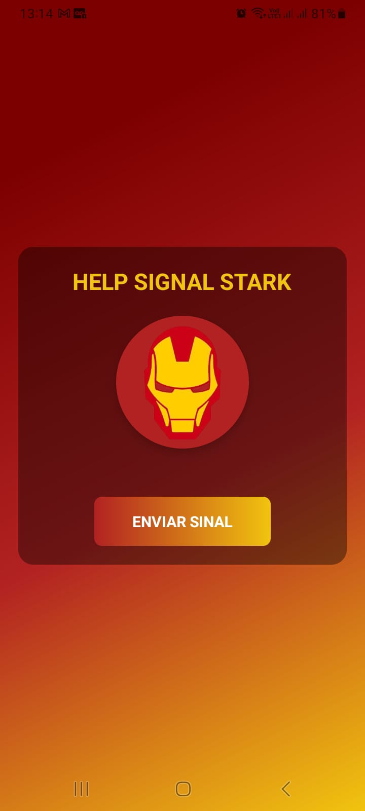
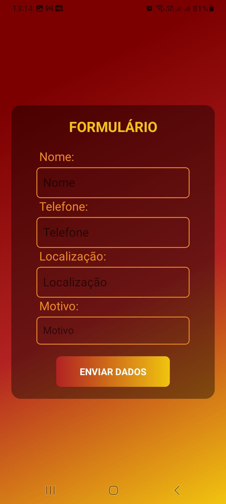
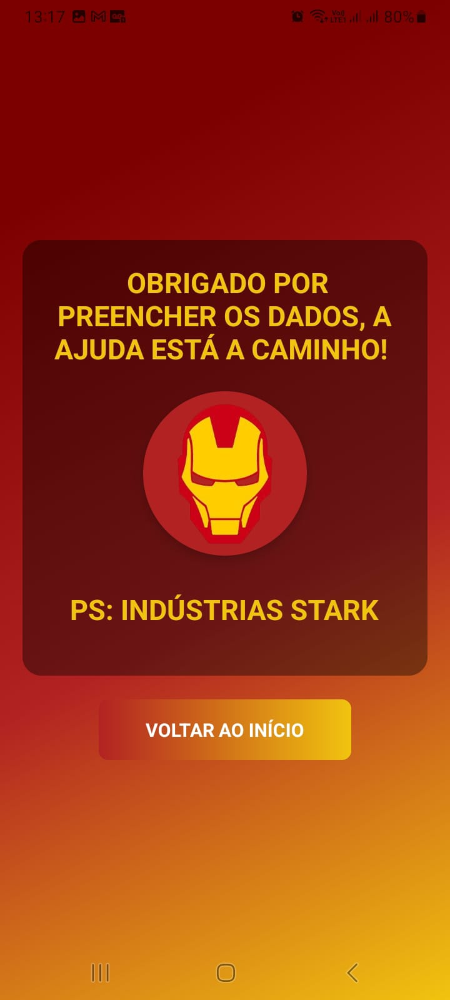
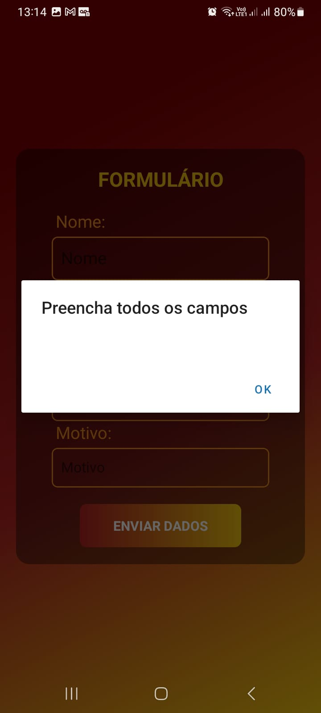
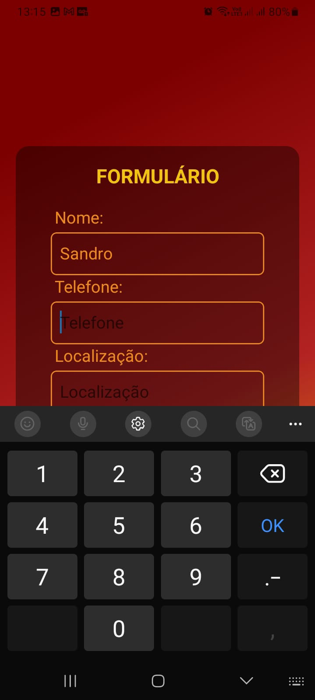
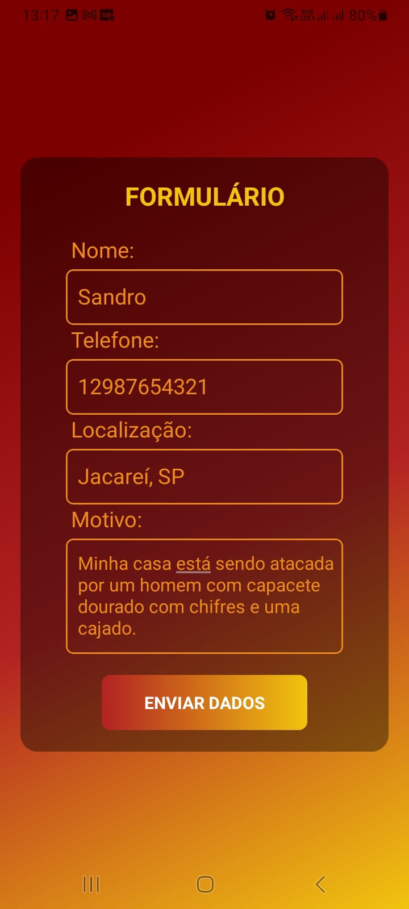
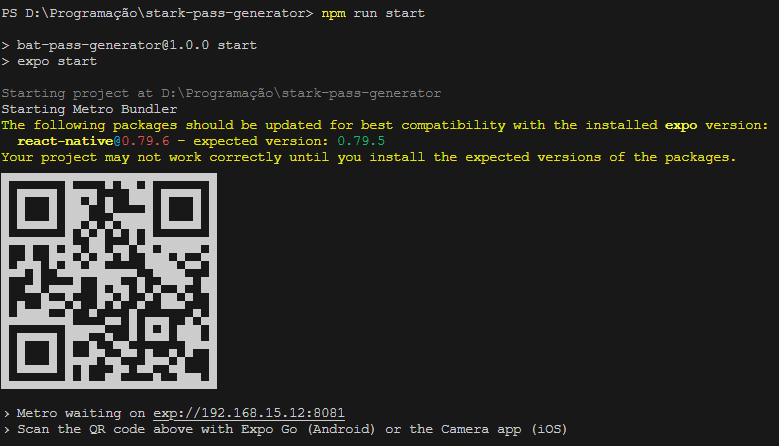

# App de Stark Sinal
>_💻 Status do projeto: Finalizado._

## Descrição do Projeto

O projeto se trata de uma aplicação mobile que simula um aplicativo para pedir ajuda ao homem de ferro.

## Telas

### Tela Principal



### Tela de Formulário



### Tela de Sucesso



## Inputs

### Falta de dados

Caso não sejam preenchidos todos os campos, uma mensagem será mostrada na tela



### Campo telefone

O campo telefone tem um teclado numérico



### Campo motivo

O campo motivo permite um texto com até 5 linhas.



## Como rodar

Ao baixar o projeto instale as dependências com:

```
npm install
```

Para rodar a aplicação use o comando:

```
npm run start
```

Será então gerado um QRCODE que será possível escanear pelo aplicativo _**EXPO GO**_.


